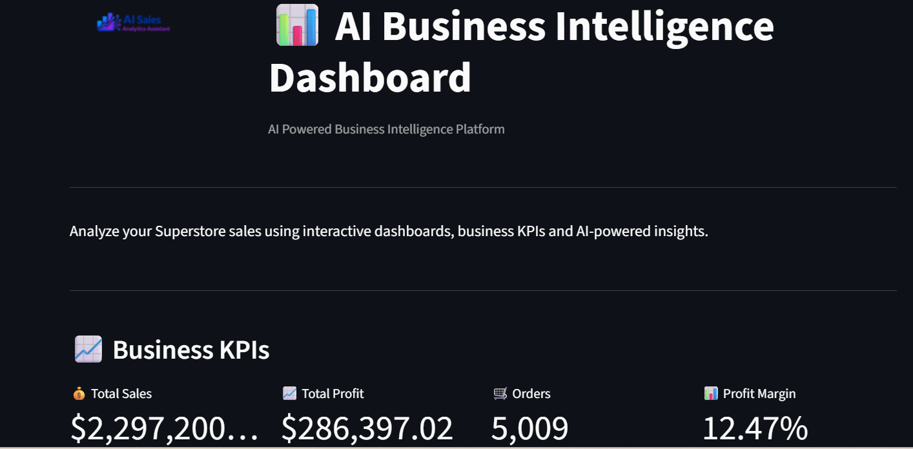
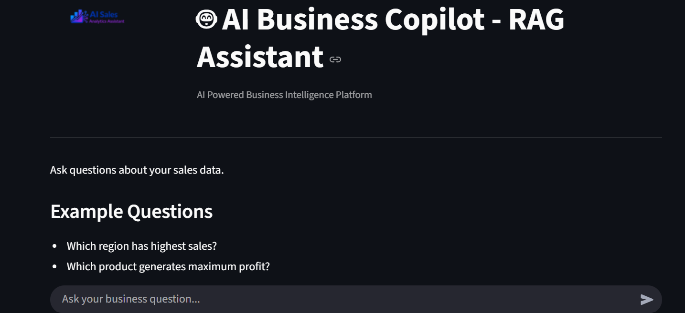
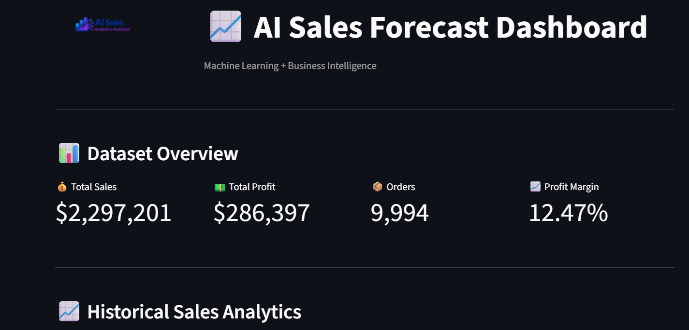
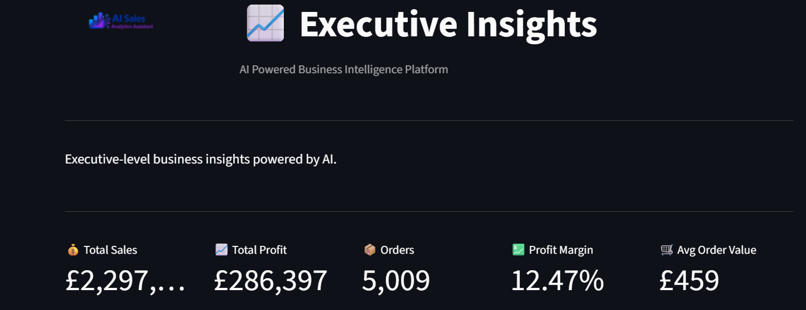
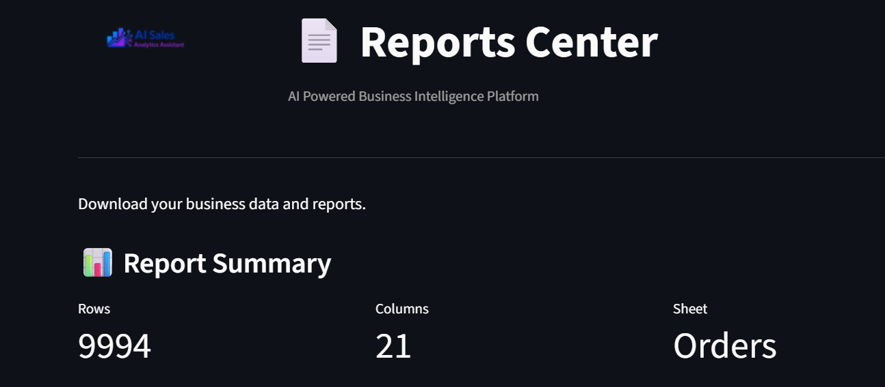
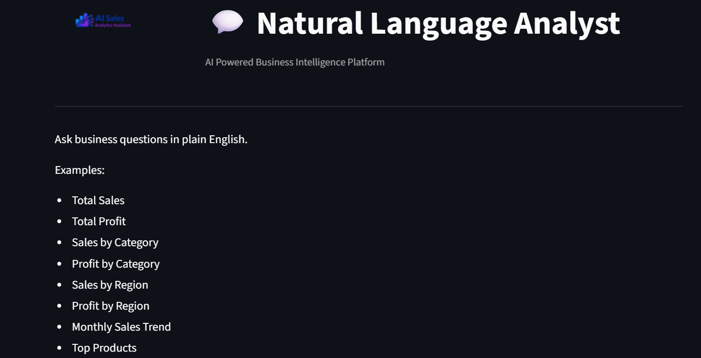
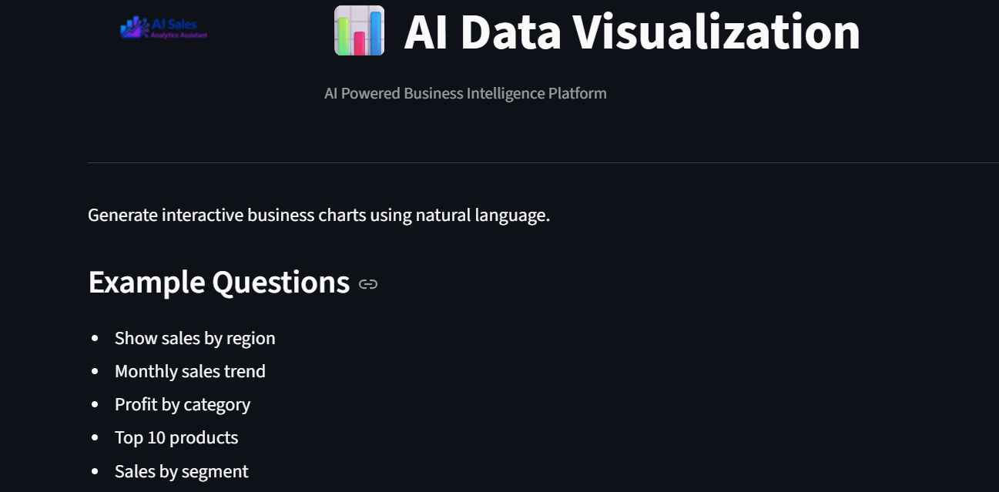

<p align="center">


</p>

<h1 align="center">🚀 AI Sales Analytics Assistant</h1>

<p align="center">

Machine Learning • Business Intelligence • Generative AI

</p>

<p align="center">

Forecast • Analyze • Visualize • Decide

</p>

<p align="center">


</p>

---

# 📊 AI Sales Analytics Assistant

An end-to-end AI-powered Sales Analytics Platform built using **Python, Machine Learning, Business Intelligence, Streamlit, and Google Gemini AI**.

...


# 📊 AI Sales Analytics Assistant

An end-to-end **AI-powered Sales Analytics Platform** built using **Python, Machine Learning, Business Intelligence, Streamlit, and Google Gemini AI**.

The application helps businesses analyze sales performance, forecast future sales, generate executive reports, and interact with business data using Generative AI.

---

# 🚀 Features

## 📈 Interactive Dashboard
- Sales KPIs
- Revenue Trends
- Profit Analysis
- Regional Performance
- Category Analysis
- Customer Segment Analysis
- Monthly Sales Trend
- Top Products
- Executive BI Dashboard

---

## 🤖 AI Sales Forecasting

Predict future sales using a trained Machine Learning model.

### Input Features
- Category
- Region
- Segment
- Quantity
- Discount

### Output
- Predicted Sales
- Growth %
- Business Recommendations
- Confidence Indicator
- Forecast History

---

## 🧠 AI Business Assistant

Powered by **Google Gemini**

Capabilities:

- Business Q&A
- Sales Insights
- Trend Analysis
- Executive Recommendations
- Data Interpretation

---

## 📄 AI Executive Reports

Generate professional reports including:

- Executive Summary
- Business KPIs
- SWOT Analysis
- Risks
- Opportunities
- Strategic Recommendations

Export reports as PDF.

---

## 📊 AI Data Visualizer

Create interactive visualizations including:

- Line Charts
- Bar Charts
- Pie Charts
- Scatter Plots
- Histograms
- Heatmaps

---

## 💬 Natural Language Analytics

Ask business questions in plain English.

Example:

> Which region generated the highest revenue?

> Which category is most profitable?

> Show monthly sales trend.

---

## 📈 Executive BI Dashboard

Executive-level analytics including:

- Revenue KPI
- Profit KPI
- Business Health Score
- Revenue Target Achievement
- Regional Ranking
- Monthly Performance Timeline
- AI Executive Summary

---

# 🛠 Tech Stack

## Programming

- Python

## Machine Learning

- Scikit-learn
- Joblib

## Data Processing

- Pandas
- NumPy

## Visualization

- Plotly
- Streamlit

## AI

- Google Gemini API

## Report Generation

- ReportLab

---
# 📸 Application Screenshots

## 📊 Dashboard



---

## 🤖 AI Assistant



---

## 📉 Sales Prediction



---

## 📈 Executive BI Dashboard



---

## 📄 Reports



---

## 💬 Natural Language Analyst



---

## 📊 AI Data Visualizer



# 📂 Project Structure

```
AI-Sales-Analytics-Assistant/
│
├── app.py
│
├── data/
│
├── models/
│   └── sales_model.pkl
│
├── history/
│   └── forecast_history.csv
│
├── pages/
│   ├── Dashboard.py
│   ├── AI_Assistant.py
│   ├── Sales_Prediction.py
│   ├── Reports.py
│   ├── Executive_BI_Dashboard.py
│   ├── Natural_Language_Analyst.py
│   └── AI_Data_Visualizer.py
│
├── utils/
│   ├── data_loader.py
│   ├── forecast_ai.py
│   ├── gemini_helper.py
│   ├── pdf_report.py
│   ├── report_ai.py
│   ├── theme.py
│   └── visualization.py
│
├── requirements.txt
├── README.md
└── .env
```

---

# ⚙ Installation

Clone the repository

```bash
git clone https://github.com/yourusername/AI-Sales-Analytics-Assistant.git
```

Move into the project

```bash
cd AI-Sales-Analytics-Assistant
```

Install dependencies

```bash
pip install -r requirements.txt
```

Run the application

```bash
streamlit run app.py
```

---

# 🔑 Environment Variables

Create a `.env` file.

```
GOOGLE_API_KEY=YOUR_API_KEY
GEMINI_MODEL=gemini-2.5-flash
```

---

# 📸 Screenshots

## Dashboard

_Add dashboard screenshot here_

---

## Sales Prediction

_Add prediction page screenshot here_

---

## AI Assistant

_Add AI assistant screenshot here_

---

## Executive Dashboard

_Add executive dashboard screenshot here_

---

# 📊 Machine Learning Workflow

```
Business Data

↓

Data Cleaning

↓

Feature Engineering

↓

Model Training

↓

Sales Prediction

↓

Business Insights

↓

AI Analysis

↓

Executive Reports
```

---

# 🎯 Business Value

This application helps organizations:

- Forecast future sales
- Improve decision-making
- Identify business opportunities
- Monitor KPIs
- Generate executive reports
- Reduce manual reporting effort
- Gain AI-driven insights

---

# 🔮 Future Enhancements

- Authentication
- Multi-user support
- Database integration
- Live sales data
- Auto ML
- Time-series forecasting
- Inventory optimization
- Sales anomaly detection
- Email reports
- Cloud deployment

---

# 👩‍💻 Author

**Vandana Singh**

**Data Science | Machine Learning | Business Intelligence | Generative AI**

GitHub:
https://github.com/YOUR_USERNAME

LinkedIn:
https://linkedin.com/in/YOUR_PROFILE

---

# ⭐ Support

If you found this project helpful,

⭐ Star this repository.

It motivates further development.

---

# 📜 License

This project is released under the MIT License.

